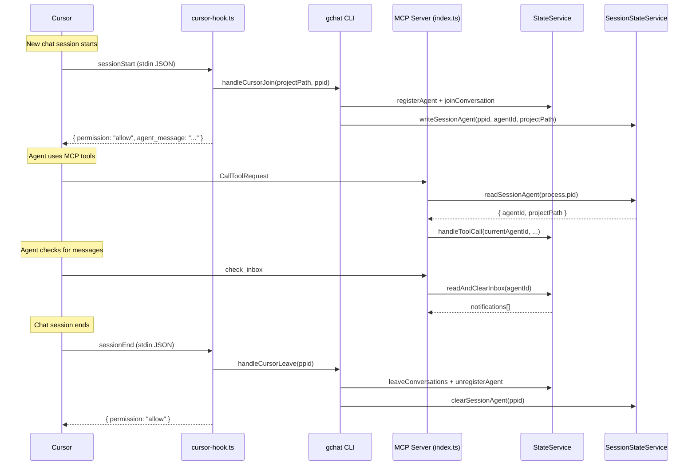

# :joystick: Add Cursor session lifecycle hooks and per-session agent management

> What does this pull request accomplish and what is its impact?

- Enables Cursor IDE agents to participate in group-chat-mcp via per-session lifecycle hooks, solving the problem of Cursor's long-lived MCP server process sharing a single agent ID across multiple chat sessions.

- Cursor keeps MCP server processes alive across chat sessions, unlike Claude Code which spawns a new process per conversation. The existing self-registering architecture bound one agent ID at startup and closed over it for all tool calls. This PR adds a hooks-based session lifecycle (`sessionStart`, `sessionEnd`, `beforeMCPExecution`) that registers and unregisters agents per Cursor session via a session state file keyed by server PID. A `check_inbox` MCP tool replaces the push-based `claude/channel` notification mechanism that Cursor does not support. The inbox poller is conditionally disabled when `GC_CLIENT_TYPE=cursor`. The installer writes both `mcp.json` and `hooks.json` for Cursor targets. Notification utilities are extracted from `tool-handlers.ts` into a shared module to be reusable by CLI commands and the MCP server.

## :bar_chart: Summary of Changes
> Which files were involved in this implementation?

- `src/services/session-state-service.ts` -- added -- Per-PID session state management with write, read, clear, and stale session reaping
- `src/hooks/cursor-hook.ts` -- added -- Cursor hook script handling sessionStart, sessionEnd, and beforeMCPExecution events via stdin/stdout JSON
- `src/utils/notification-utils.ts` -- added -- Extracted `formatNotificationContent` and `writeNotificationToParticipants` from tool-handlers for shared use
- `src/types/session-state.ts` -- added -- `SessionState` interface (pid, agentId, projectPath, updatedAt)
- `src/types/hook-input.ts` -- added -- `HookInput` interface for Cursor hook stdin JSON
- `src/types/hook-response.ts` -- added -- `HookResponse` interface for Cursor hook stdout JSON
- `src/gchat.ts` -- modified -- Added `cursor-join` and `cursor-leave` CLI commands with `handleCursorJoin` and `handleCursorLeave` functions
- `src/index.ts` -- modified -- Dynamic agent ID resolution from session state on each tool call; conditional inbox poller skip for Cursor; session state write/clear on startup/shutdown; stale session reaping
- `src/services/tool-handlers.ts` -- modified -- Added `check_inbox` tool handler; removed `writeNotificationToParticipants` (moved to notification-utils)
- `src/services/installer-service.ts` -- modified -- Writes `hooks.json` with sessionStart/sessionEnd/beforeMCPExecution entries on Cursor install; cleans up hooks on uninstall; added `resolveHooksPath` and `resolveHookScriptPath` methods; added `GC_CLIENT_TYPE` and `GC_POLL_INTERVAL_MS` env vars to Cursor mcp.json
- `src/services/state-service.ts` -- modified -- Added `readAndClearInbox` method and `baseDir` getter
- `src/services/inbox-poller.ts` -- modified -- Removed inline `formatNotificationContent`; imports from notification-utils
- `src/schemas/tool-schemas.ts` -- modified -- Added `CheckInboxArgsSchema` and `check_inbox` tool definition
- `src/constants/env.ts` -- modified -- Added `GC_CLIENT_TYPE` env constant
- `src/constants/settings-paths.ts` -- modified -- Added `CURSOR_HOOKS_GLOBAL` and `CURSOR_HOOKS_LOCAL()` path constants
- `src/constants/storage.ts` -- modified -- Added `SESSIONS_DIR` constant
- `src/types/parsed-command.ts` -- modified -- Changed `ParsedCommand` from interface to discriminated union type with cursor-join and cursor-leave variants
- `src/types/parsed-error.ts` -- modified -- Added `missing-required-arg` error variant and optional `message` field
- `src/types/index.ts` -- modified -- Re-exports for HookInput, HookResponse, SessionState
- `vitest.config.ts` -- added -- Vitest configuration targeting `src/__tests__/**/*.test.ts`
- `src/__tests__/check-inbox.test.ts` -- added -- 4 tests for the check_inbox tool (read, clear, empty inbox, formatting)
- `src/__tests__/cli-session-commands.test.ts` -- added -- 9 tests for cursor-join and cursor-leave CLI commands
- `src/__tests__/cursor-hook.test.ts` -- added -- 6 tests for the cursor hook script (beforeMCPExecution allow/ask, invalid JSON, unknown event, sessionEnd, sessionStart)
- `src/__tests__/installer-hooks.test.ts` -- added -- 4 tests for hooks.json install/uninstall (creation, merge with existing, removal, env vars)
- `src/__tests__/session-state-service.test.ts` -- added -- 5 tests for SessionStateService (write, read, read-missing, clear, reap stale)

## :wrench: Technical Implementation Details
> What are the detailed technical changes that were made?

- **Session State Management (`SessionStateService`)**
  - Stores per-PID session files at `{BASE_DIR}/sessions/{pid}.json` containing `{ pid, agentId, projectPath, updatedAt }`
  - In-memory `Map<number, { agentId, projectPath }>` cache avoids repeated file reads on each tool call
  - `reapStaleSessions()` iterates session files, checks PID liveness via `isProcessAlive()`, and deletes files for dead processes
  - Uses atomic writes via `writeJsonFile` from existing file-utils

- **Dynamic Agent ID Resolution (`src/index.ts`)**
  - On each `CallToolRequest`, reads the session state for `process.pid` and uses the session agent ID if present, falling back to the startup-registered agent ID
  - On shutdown, resolves the current agent ID from session state before running leave/unregister logic
  - Session state is written immediately after agent registration at startup
  - Stale sessions are reaped alongside stale agents during initialization

- **Cursor Hook Script (`src/hooks/cursor-hook.ts`)**
  - Reads JSON from stdin with a 5-second timeout
  - Dispatches on `hook_event_name`: `sessionStart` calls `handleCursorJoin`, `sessionEnd` calls `handleCursorLeave`, `beforeMCPExecution` returns `{ permission: "allow" }` for `group-chat-mcp` and `{ permission: "ask" }` for all other servers
  - Uses `process.ppid` as the server PID (the hook is a child of the Cursor MCP server process)
  - Gracefully handles invalid JSON and unknown events by returning `{ permission: "allow" }`

- **CLI Session Commands (`src/gchat.ts`)**
  - `cursor-join --project <path> --server-pid <pid>`: registers agent, creates/joins project conversation, writes session state, writes join notification, outputs JSON `{ agentId, conversationId }`
  - `cursor-leave --server-pid <pid>`: reads session state, leaves all conversations with leave notifications, unregisters agent, clears session state
  - `ParsedCommand` changed to a discriminated union type to carry command-specific fields (`project`, `serverPid`)
  - `ParsedError` extended with `missing-required-arg` variant and optional `message`

- **`check_inbox` MCP Tool (`src/services/tool-handlers.ts`)**
  - Reads all pending notifications via `stateService.readAndClearInbox(agentId)` which atomically reads and empties the inbox under file lock
  - Formats notifications using the same `formatNotificationContent` function as the inbox poller
  - Returns `"No new notifications."` for empty inbox

- **Conditional Inbox Poller (`src/index.ts`)**
  - When `GC_CLIENT_TYPE === 'cursor'`, the `InboxPollerService.start()` call is skipped since Cursor does not support `notifications/claude/channel`

- **Notification Utilities Extraction (`src/utils/notification-utils.ts`)**
  - `formatNotificationContent` and `writeNotificationToParticipants` moved from `tool-handlers.ts` to a shared utility module
  - `writeNotificationToParticipants` now uses `stateService.baseDir` instead of the hardcoded `BASE_DIR` constant, enabling test injection of temp directories

- **Installer Hooks Support (`src/services/installer-service.ts`)**
  - `install()` for Cursor writes `hooks.json` with three hook entries (sessionStart, sessionEnd, beforeMCPExecution) using idempotent merge logic that preserves existing non-group-chat-mcp hooks
  - `uninstall()` for Cursor removes all entries containing `cursor-hook.js` from every hook event array while preserving other entries
  - `resolveHooksPath()` maps IDE + Scope to `~/.cursor/hooks.json` (global) or `.cursor/hooks.json` (local)
  - `resolveHookScriptPath()` resolves the built hook script at `dist/hooks/cursor-hook.js` relative to the service file
  - Cursor mcp.json now includes `GC_CLIENT_TYPE: 'cursor'` and `GC_POLL_INTERVAL_MS: '5000'` in the env block

## :classical_building: Architecture & Flow
> How does this implementation affect the system's architecture or data flow?

- The MCP server now supports two distinct agent lifecycle models. Claude Code continues with process-per-conversation where the agent ID is fixed at startup. Cursor uses hook-driven per-session agent registration where the agent ID is resolved dynamically from a session state file on each tool call.

## :white_check_mark: Manual Acceptance Testing
> How can this implementation be manually tested?

### Cursor install writes hooks.json

- **Objective:** Verify that `gchat install` for Cursor creates both `mcp.json` and `hooks.json` with the correct entries
- **Prerequisites:** Node.js installed, project built (`npm run build`)
- [ ] Run `npx group-chat-mcp install`, select Cursor, select Global -- verify `~/.cursor/mcp.json` contains `group-chat-mcp` entry with `GC_CLIENT_TYPE: "cursor"` and `GC_POLL_INTERVAL_MS: "5000"` in env
- [ ] Verify `~/.cursor/hooks.json` contains `sessionStart`, `sessionEnd`, and `beforeMCPExecution` entries referencing `cursor-hook.js`
- **Success criteria:** Both files exist with correct entries

### Cursor session lifecycle via hooks

- **Objective:** Verify that Cursor sessionStart and sessionEnd hooks register and unregister agents
- **Prerequisites:** Node.js installed, project built (`npm run build`), group-chat-mcp installed in Cursor
- [ ] Open a new Cursor chat session in a project -- verify that the sessionStart hook logs (stderr) confirm agent registration
- [ ] Use MCP tools in the chat -- verify tool calls resolve the correct session agent
- [ ] Close the chat session -- verify session state file is cleaned up
- **Success criteria:** Agent is created on session start and removed on session end

### check_inbox tool returns notifications

- **Objective:** Verify that the check_inbox tool reads and clears pending notifications
- **Prerequisites:** Two agents in the same project conversation (one Claude Code, one Cursor)
- [ ] Send a message from the Claude Code agent
- [ ] Call `check_inbox` from the Cursor agent -- verify the message notification is returned
- [ ] Call `check_inbox` again -- verify "No new notifications." is returned
- **Success criteria:** Notifications are returned on first call and cleared on subsequent call

## :link: Dependencies & Impacts
> Does this change introduce new dependencies or have other system-wide impacts?

- No new packages or libraries added
- No breaking changes to existing Claude Code flow; the startup-registered agent ID is used as fallback when no session state exists
- `writeNotificationToParticipants` moved from `tool-handlers.ts` to `utils/notification-utils.ts`; all existing callers updated to use the new import path
- `ParsedCommand` changed from an interface to a discriminated union type; existing `install`/`uninstall` variants are preserved

## :clipboard: Checklist
> Has everything been verified before submission?

- [x] All tests pass and code follows project conventions
- [x] Performance and security considered
- [x] Breaking changes documented; manual testing complete where required
- [x] 28 tests across 5 test files covering all new business logic

## :mag: Related Issues
> Which issues does this pull request address?

- Implements `workspace/issues/cursor-hooks-support/feature-00-cursor-hooks-support.md` (all 7 sub-issues: 01A, 01B, 02, 03, 04, 05)

## :memo: Additional Notes
> Is there any other relevant information?

- The `beforeMCPExecution` hook auto-approves only `group-chat-mcp` tools and returns `{ permission: "ask" }` for all other MCP servers, preserving Cursor's default approval flow for third-party tools
- Session state reaping uses the same `isProcessAlive` PID check already used by the file lock utility, ensuring consistency
- The `check_inbox` tool description instructs agents to poll periodically, compensating for the lack of push notifications in Cursor
