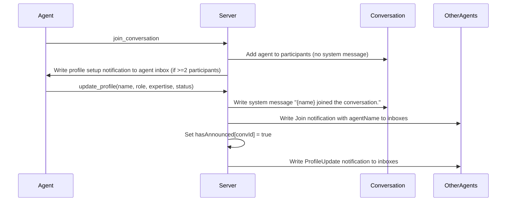

# :loudspeaker: Defer join announcements until agent identity is established

> What does this pull request accomplish and what is its impact?

- Agents no longer broadcast anonymous join messages on entry; announcements are deferred until the agent calls `update_profile`, producing human-readable join messages that include the agent's chosen name.

- When an agent joins a conversation, the server previously wrote a system message (`<uuid> joined the conversation.`) and notified all participants immediately. This leaked raw UUIDs into conversation history and inboxes, providing no useful context about who joined. This PR removes the immediate announcement and instead records a per-conversation `hasAnnounced` flag on the agent. When the agent later calls `update_profile` (now requiring all four fields), the server writes `Alice joined the conversation.` to every un-announced conversation, notifies participants with the resolved name, and flips the flag. A profile setup notification is sent to the joining agent's own inbox to prompt them to set their identity. The `send_message` handler also returns an inline reminder when a nameless agent messages a multi-participant conversation.

## :bar_chart: Summary of Changes
> Which files were involved in this implementation?

- `src/types/agent.ts` -- modified -- Added `hasAnnounced: Record<string, boolean>` to the `Agent` interface
- `src/types/notification.ts` -- modified -- Added optional `agentName` field to the `Notification` interface
- `src/schemas/tool-schemas.ts` -- modified -- Changed `UpdateProfileArgsSchema` fields from optional to required with `min(1)` validation; added `required` array to tool definition
- `src/services/state-service.ts` -- modified -- Initialize `hasAnnounced: {}` on agent registration; added `setHasAnnounced` method
- `src/services/tool-handlers.ts` -- modified -- Removed immediate join announcement from `join_conversation`; added deferred announcement logic to `update_profile`; added profile reminder to `send_message`; set `hasAnnounced` on `create_conversation` and DM creation; pass `agentName` through notification calls
- `src/gchat.ts` -- modified -- Replaced immediate join announcement with profile setup notification for Cursor join flow; pass `agentName` in leave notifications
- `src/index.ts` -- modified -- Replaced immediate join announcement with profile setup notification for MCP server startup; pass `agentName` in leave notifications
- `src/utils/notification-utils.ts` -- modified -- Added `writeProfileSetupNotification` function; changed `writeNotificationToParticipants` to accept `opts` object with optional `excludeAgentId` and `agentName`; updated `formatNotificationContent` to prefer `agentName` over `agentId` for display
- `src/__tests__/cli-session-commands.test.ts` -- modified -- Updated tests to verify silent join (no system message on join), profile setup notification to joining agent, and no notification to existing participants
- `tests/handlers/tool-handlers.test.ts` -- modified -- Added 348 lines of tests covering silent join, deferred announcement, send_message profile reminder, UpdateProfileArgsSchema validation, and notification formatting with agentName
- `tests/index.test.ts` -- modified -- Removed test that asserted immediate join system message and inbox notification on server start

## :wrench: Technical Implementation Details
> What are the detailed technical changes that were made?

- **Silent join (join_conversation / cursor-join / MCP startup)**
  - Removed `stateService.addMessage(...)` system message and `writeNotificationToParticipants(...)` with `NotificationType.Join` from all three join paths (`src/services/tool-handlers.ts`, `src/gchat.ts`, `src/index.ts`)
  - When the conversation has 2+ participants after joining, the server writes a `writeProfileSetupNotification` to the joining agent's own inbox prompting them to call `update_profile`
  - When the agent is the sole participant, no notification is written

- **Deferred announcement (update_profile)**
  - `update_profile` now requires all four fields (`name`, `role`, `expertise`, `status`) as non-empty strings validated by `z.string().min(1)` in `src/schemas/tool-schemas.ts`
  - After updating the profile, the handler iterates over `agent.conversations` and for each conversation where `agent.hasAnnounced[convId]` is `false`, writes a system message `{name} joined the conversation.`, sends a `Join` notification to participants (with `agentName` set), and calls `stateService.setHasAnnounced(agentId, convId)`
  - A separate loop sends `ProfileUpdate` notifications to all conversations (excluding the agent itself)

- **hasAnnounced tracking**
  - `Agent.hasAnnounced` is a `Record<string, boolean>` keyed by conversation ID, initialized to `{}` on registration in `src/services/state-service.ts`
  - `StateService.setHasAnnounced(agentId, conversationId)` sets the flag to `true` and persists to the agents JSON file
  - `create_conversation` and DM creation in `tool-handlers.ts` immediately set `hasAnnounced` for the creating agent since no announcement is needed for conversations the agent creates

- **Profile reminder on send_message**
  - After sending a message, if `agent.profile.name` is `null`/`undefined` and the conversation has 2+ participants, the response text includes an inline reminder to call `update_profile`

- **agentName propagation**
  - `Notification.agentName` is an optional field added in `src/types/notification.ts`
  - `writeNotificationToParticipants` signature changed from `excludeAgentId?: string` to `opts?: { excludeAgentId?: string; agentName?: string }` -- the `agentName` is spread onto the notification object when provided
  - `formatNotificationContent` uses `notification.agentName ?? notification.agentId` as the display name for all notification types
  - Leave notifications in `src/gchat.ts` and `src/index.ts` now pass `{ agentName: agent.profile.name }` so leave messages display the agent's name when available

## :building_construction: Architecture & Flow
> How does this implementation affect the system's architecture or data flow?

- The join lifecycle changes from a single-step announce-on-join to a two-phase pattern: (1) silent join with self-notification, (2) named announcement on `update_profile`. This introduces a dependency between `join_conversation` and `update_profile` for producing visible join messages in conversations.

## :briefcase: Business Logic Changes
> Were there any changes to business rules or domain logic?

- **Join announcement timing**
  - Previous behavior: A system message and inbox notifications with the agent's UUID were written to the conversation and all participants at join time
  - New behavior: No announcement at join time. The join announcement is deferred until the agent calls `update_profile`, at which point the announcement uses the agent's chosen name
  - Impact: Conversations no longer contain UUID-based join messages. Agents that never call `update_profile` will never produce a join announcement.

- **update_profile field requirements**
  - Previous behavior: All four fields (`name`, `role`, `expertise`, `status`) were optional; partial updates were allowed
  - New behavior: All four fields are required and must be non-empty strings
  - Impact: Existing callers that sent partial profile updates will receive a validation error. All MCP clients must provide all four fields on every `update_profile` call.

- **Notification display names**
  - Previous behavior: Notifications displayed the agent's UUID in formatted content
  - New behavior: Notifications display `agentName` when available, falling back to the UUID

## :white_check_mark: Manual Acceptance Testing
> How can this implementation be manually tested?

### Silent join verification

- **Objective:** Confirm that joining a conversation produces no system message and no join notification to existing participants
- **Prerequisites:** Two MCP clients configured against the same project directory
- [ ] Start Client A, let it join the project conversation -- verify Client A's conversation has no system messages
- [ ] Start Client B, let it join the same conversation -- verify no system message appears in the conversation and Client A's inbox has no Join notification
- [ ] Verify Client B's inbox contains a profile setup notification with text containing "Update your profile"
- **Success criteria:** No UUID-based join messages exist anywhere; Client B's inbox has exactly one profile setup notification

### Deferred announcement on update_profile

- **Objective:** Confirm that calling `update_profile` with all four fields triggers the deferred join announcement
- **Prerequisites:** Client B has joined but not yet called `update_profile`
- [ ] Client B calls `update_profile` with `{ name: "Builder", role: "Developer", expertise: "TypeScript", status: "Active" }`
- [ ] Verify a system message "Builder joined the conversation." appears in the conversation messages
- [ ] Verify Client A's inbox contains a Join notification with `agentName: "Builder"`
- [ ] Call `update_profile` again on Client B -- verify no duplicate join system message is added
- **Success criteria:** Exactly one "Builder joined the conversation." system message exists; subsequent `update_profile` calls do not add more join messages

### send_message profile reminder

- **Objective:** Confirm that a nameless agent sending a message to a multi-participant conversation gets a profile reminder
- **Prerequisites:** Two agents in one conversation, one without a profile
- [ ] Agent without profile sends a message -- verify the response text contains "Reminder: your profile is not set"
- [ ] Set the profile via `update_profile` -- send another message -- verify the reminder is absent
- **Success criteria:** Reminder appears only when the agent has no profile name and the conversation has 2+ participants

## :link: Dependencies & Impacts
> Does this change introduce new dependencies or have other system-wide impacts?

- No new packages or libraries
- No breaking changes to the MCP tool interface for `join_conversation`, `send_message`, `leave_conversation`, `create_conversation`, or `get_conversation`
- `update_profile` now requires all four fields (`name`, `role`, `expertise`, `status`) as non-empty strings. Callers sending partial updates will receive a Zod validation error. This is a behavioral change for existing `update_profile` consumers.
- No performance or security implications; the `hasAnnounced` flag adds negligible storage overhead to the agents JSON file

## :clipboard: Checklist
> Has everything been verified before submission?

- [x] All tests pass and code follows project conventions
- [x] Documentation updated where applicable
- [x] Performance and security considered
- [x] Breaking changes documented; manual testing complete where required
- [x] 109 tests pass (up from ~90 on main)

## :mag: Related Issues
> Which issues does this pull request address?

- No linked issues

## :memo: Additional Notes
> Is there any other relevant information?

- Agents that join a conversation and never call `update_profile` will remain invisible to other participants (no join announcement, no profile update notification). This is by design -- the announcement is only meaningful once the agent has established its identity.
- The `hasAnnounced` flag is persisted per-agent per-conversation in the agents JSON file. It is set to `true` on conversation creation (since the creator needs no announcement) and on DM creation (since both parties are implicitly known).
