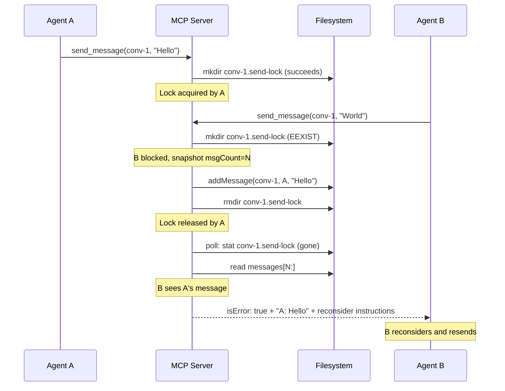

# 🔒 feat(send): add per-conversation send lock to serialize concurrent sends

> What does this pull request accomplish and what is its impact?

- Introduces a per-conversation send lock that serializes concurrent `send_message` calls within the same conversation, forcing agents to acknowledge competing messages before sending.

- When multiple agents send to the same conversation simultaneously, the first agent acquires a directory-based lock and proceeds normally. Subsequent agents wait internally (polling with jitter) until the lock releases, then receive the competing message(s) with instructions to reconsider and resend. This eliminates interleaved or duplicated messages caused by agents not seeing each other's in-flight writes. Agents sending to different conversations remain unaffected.

## 📊 Summary of Changes
> Which files were involved in this implementation?

- `src/utils/send-lock.ts` — added — Send lock module: `tryAcquireSendLock`, `waitForSendLockRelease`, `releaseSendLock`, `readSendLockInfo`, `sendLockDir`, `getMessagesSince`, `getMessageCount`
- `src/__tests__/send-lock.test.ts` — added — 340-line test suite covering lock acquisition, contention, stale break, cleanup, message snapshot, and participation guard
- `src/utils/file-lock.ts` — modified — Exported `LOCK_INFO_FILENAME` and `forceRemoveLock` so `send-lock.ts` can reuse them
- `src/services/tool-handlers.ts` — modified — Wrapped `send_message` handler in send lock acquire/release with contention retry loop
- `src/index.ts` — modified — Added send lock cleanup to the shutdown handler; fixed `inboxPoller.start` to use `stateService.baseDir`

## 🔧 Technical Implementation Details
> What are the detailed technical changes that were made?

- **Send lock module (`src/utils/send-lock.ts`)**
  - Lock path: `{baseDir}/messages/{conversationId}.send-lock/` directory containing a `lock.info` file with `{pid, agentId, timestamp}`
  - `tryAcquireSendLock(lockDir, agentId)` uses atomic `fs.mkdir()` to acquire; returns `{acquired: true}` or `{acquired: false, holderAgentId}` on `EEXIST`
  - `waitForSendLockRelease(lockDir, timeoutMs)` polls at 50-150ms jittered intervals until the lock directory disappears or timeout fires. On timeout, compares the current `lock.info` against the original snapshot to detect re-acquisition by a third agent (avoids breaking a fresh lock). Falls back to PID liveness check via `isProcessAlive` before force-removing a stale lock
  - `releaseSendLock(lockDir)` removes `lock.info` then `rmdir` on the lock directory, both tolerating `ENOENT`
  - `getMessagesSince(messagesPath, sinceIndex)` and `getMessageCount(messagesPath)` read the messages JSON file to support the snapshot-and-diff contention flow
  - Reuses `LOCK_INFO_FILENAME`, `isProcessAlive`, and `forceRemoveLock` from `file-lock.ts`

- **Send lock integration (`src/services/tool-handlers.ts`)**
  - The `send_message` case now resolves the target conversation ID first, then enters a contention retry loop (max 5 attempts)
  - Each iteration: snapshot message count, attempt lock acquisition, wait on contention, diff messages since snapshot
  - If competing messages arrived during the wait, returns them as an `isError: true` response with sender names and reconsideration instructions — the agent's original message is never sent
  - If the lock is acquired (no contention or no new messages), `addMessage()` runs inside a `try/finally` that guarantees `releaseSendLock()` on success or failure
  - After exhausting retries, one final `tryAcquireSendLock` attempt is made before returning an error

- **Shutdown cleanup (`src/index.ts`)**
  - Before writing leave messages, the cleanup handler iterates the agent's conversations and releases any send locks where `lockInfo.agentId` matches the current agent
  - Fixed the `inboxPoller.start` call to use `stateService.baseDir` instead of the removed `BASE_DIR` import

- **file-lock.ts exports**
  - `LOCK_INFO_FILENAME` changed from module-private `const` to `export const`
  - `forceRemoveLock` changed from module-private `async function` to `export async function`

## 🏗️ Architecture & Flow
> How does this implementation affect the system's architecture or data flow?

- The send lock sits between conversation/participant validation and `stateService.addMessage()`. It is distinct from the existing file-write lock on `messages/{conversationId}.json` — the file-write lock protects I/O atomicity (milliseconds), while the send lock serializes the entire send operation across agents (seconds). System messages (join, leave, profile updates) bypass the send lock entirely.

## 💼 Business Logic Changes
> Were there any changes to business rules or domain logic?

- **Message send serialization**
  - Previously, two agents sending to the same conversation simultaneously both succeeded independently; neither saw the other's in-flight message
  - Now, the second sender waits for the first to complete, receives the first sender's message(s), and must reconsider before resending
  - Impact: agents produce contextually aware responses instead of talking past each other

- **Contention response contract**
  - Previously, `send_message` always returned a success response with the sent message ID
  - Now, on contention with competing messages detected, `send_message` returns `isError: true` containing the competing messages (sender name + content), the conversation ID, and the instruction: "One or more messages were sent to this conversation while you were preparing your message. Read them carefully, reconsider your original intent in light of what was said, and send a new message. Do NOT resend your original message verbatim."
  - The blocked agent's original message is never sent in this case

## ✅ Manual Acceptance Testing
> How can this implementation be manually tested?

### Happy path: no contention
- **Objective:** A single agent sends a message without lock interference
- **Prerequisites:** Two or more agents registered and joined to the same conversation
- [ ] Agent A calls `send_message` with a message to conversation X — expect normal success response with message ID
- [ ] Verify no `.send-lock` directory remains in `~/.group-chat-mcp/messages/`
- **Success criteria:** Message appears in conversation; no lock artifacts left behind

### Contention: two agents send simultaneously
- **Objective:** The second sender receives the first sender's message with reconsideration instructions
- **Prerequisites:** Two agents (A and B) joined to the same conversation
- [ ] Agent A and Agent B both call `send_message` to the same conversation at approximately the same time
- [ ] The agent that acquires the lock first succeeds normally
- [ ] The blocked agent receives an `isError: true` response containing the winning agent's message and the reconsideration instruction text
- [ ] The blocked agent's original message does NOT appear in the conversation
- **Success criteria:** Blocked agent sees competing message and reconsideration instructions; no message duplication

### Stale lock recovery
- **Objective:** A lock left behind by a crashed process is broken after timeout
- **Prerequisites:** Access to the filesystem at `~/.group-chat-mcp/messages/`
- [ ] Manually create a `{conversationId}.send-lock/` directory with a `lock.info` containing a dead PID and a timestamp older than 10 seconds
- [ ] Have an agent call `send_message` to that conversation — expect the stale lock to be broken and the message to send successfully
- **Success criteria:** stderr logs "Stale send lock broken (holder process dead)"; message sends normally

### Shutdown cleanup
- **Objective:** Send locks held by a disconnecting agent are released during shutdown
- **Prerequisites:** An agent currently holding a send lock (achievable by adding a delay in the send path during development)
- [ ] Terminate the agent process (SIGTERM or SIGINT)
- [ ] Verify no `.send-lock` directories remain for conversations the agent was in
- **Success criteria:** No orphaned send lock directories after shutdown

## 🔗 Dependencies & Impacts
> Does this change introduce new dependencies or have other system-wide impacts?

- No new packages or libraries added
- No breaking changes to the `send_message` tool interface (agents discover lock behavior on contention)
- Performance: blocked agents poll at 50-150ms intervals (jittered), producing 7-20 `stat` calls per second per blocked agent. Negligible for the expected 2-5 participant range. The MCP tool call remains in-flight during the wait, blocking the agent from other tool calls — acceptable since the agent has no useful action to take while waiting

## 📋 Checklist
> Has everything been verified before submission?

- [ ] All tests pass and code follows project conventions
- [ ] Documentation updated where applicable
- [ ] Performance and security considered
- [ ] Breaking changes documented; manual testing complete where required
- [ ] Send lock test suite (`src/__tests__/send-lock.test.ts`) covers acquisition, contention, stale break, cleanup via finally, message snapshot, message count, and participation guard

## 🔍 Related Issues
> Which issues does this pull request address?

- Implements `workspace/issues/per-conversation-send-lock/enhancement-01-per-conversation-send-lock.md`

## 📝 Additional Notes
> Is there any other relevant information?

- The `send_message` tool description is intentionally NOT modified. Agents discover the contention behavior when it occurs.
- The notification system is unchanged. A blocked agent may receive the competing message both via the contention response and via the normal notification poller. Duplicate exposure is acceptable.
- On SIGKILL or OOM kill, no cleanup handler executes. Recovery relies on stale detection: blocked agents check PID liveness and break the lock after the 10-second timeout.
